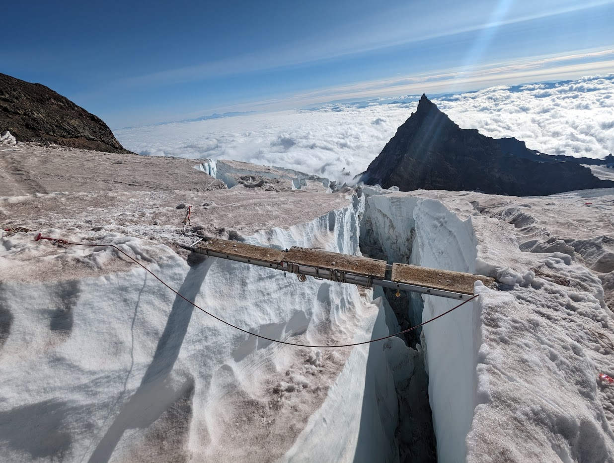

# Rainier Via Disappointment Cleaver
## Not the peak, but we got to cross a ladder!

Video Here ^^^

## Day 0
we left Seattle at 5am, and were at the Rainier parking lot by 7:45am.
Getting out our reservations, we headed to the ranger station to get our permits checked.
The ranger told us the top ladder (4 6ft ladders lashed together!) had been pulled by the guides because it was too dangerous, so our plans changed to traveling the DC to see the impassible crevasse. We were content, did a day trip to stretch our legs in the smoke and then made camp at Cougar Rock Campground.

At the campground, we met a pair from Kelowna (Steve and Andy) who were also planning on doing the DC route, but had heard that there was a slide on the route that fell the wrong way and knocked out the reasonable trail to attain the ridge. making it difficult to descend, and very difficult to protect.
These two had a very similar plan to us, and had set the same alarms.

## Day 1
We (along with Steve/Andy) got up at 4am, had breakfast, tor down camp and were on the trail by sunrise at 6:15am. We met up with them at the pebble creek turnoff (forking away from the masses to ascend to camp Muir), and Andy realised he had to run back for a lost rope (300m lost/gained for some extra exercise).
Travelling too far left on the Muir snowfield, we did not find any crevasses. The worn path surprisingly went on the hard right of the snowfield, and crossed many small crevasses exposed by the glacier under the melted away snowfield.
We were at the camp by 2:30pm, the shelter that sleeps 20 was empty, so we settled in and had a nice afternoon of napping, eating, and melting snow for water, while chatting with Andy/Steve.
The climbing rangers told us there was now heavy rockfall between the first ladder crossing and the DC, so we wouldn't be able to safely touch it.
After some discussion with Steve/Andy, we decided to join forces and wake up at 4am, and be roped up and on the glacier by 5:45am.

## Day 2
We woke up and were roped up and moving on the glacier by 5:45am. With headlamps we set off to cross the top of the Cowlitz glacier. Arthur was leading and picked a nice way through the medium crevasses to attain (what looked knarly from camp) a scree slope to travers and then assend. After minutes of faffing about with an ice screw (my foolish suggestion), we set off roped up.
It was easy, just steep. Crampons did well in the volcanic soil. It was also windy AF, and the dust would get under our goggles and into our eyes.

Once on the ridge, Art meandered us through up a ridge, through a shooting gallery of rockfall, and then up to the base of ingraham flats.
We saw many similary tents from the last guided operation of the season, as they were doing some ice climbing in a crevasse.

Their estimate of 20min was WAY off, it took us 23min to gain the base of the bowling alley,
where there was my very first ladder crossing.
It was two 5ft ladders lashed together, with descent anchoring on our side, and a hand rail rope. It was a little sketchy, but not too bad. We were all happy to be on the other side.
Then, after rejoicing, we turned around at our highpoint, and Steve lead us down, reversing the rope. I shortened up the rope to steeve so we could commnicate about route choice. Which only minorly went off route once.

Descending the volcanic soil we unroped, which was wise so we could set our own paces, and not have the rope snag on rocks.
Roping back up we crossed the Cowlitz glacier, and then made it back to camp by 10:37am (missing our 10:30 target by 7min!).

Again we relaxed, napped, chatted, and melted snow for water. We had a nice dinner, and then went to bed at around 9pm.

## Day 3
The others got up before me, and I woke up at 4:45am. We were all packed up and ready to go by 6:30am. We descended the Muir snowfield, and then made it back to paved trail (did I mention half the trail for the masses was paved!?), where the others switched to runners, and I kept my boots on. We made it back to the ranger station by 11:24am.

After some slight confusion, where it seemed I was abandoned, I met up with art, and we drove back to Seattle, stopping at a coffee place Steve/Andy recommended, where we got to say our farewells to them in the parking lot.

We made it back to Seattle by 4pm, Art dropped me and booked it to the 7pm BC ferry back to Victoria.

## Future Trip Edits
- bring a deck of cards
- bring more tea bags
- replentish the first aid kit
